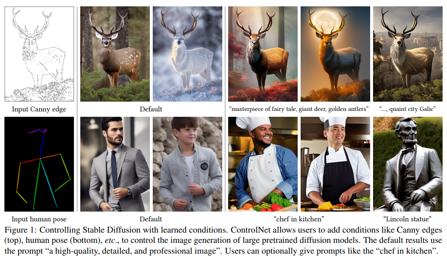
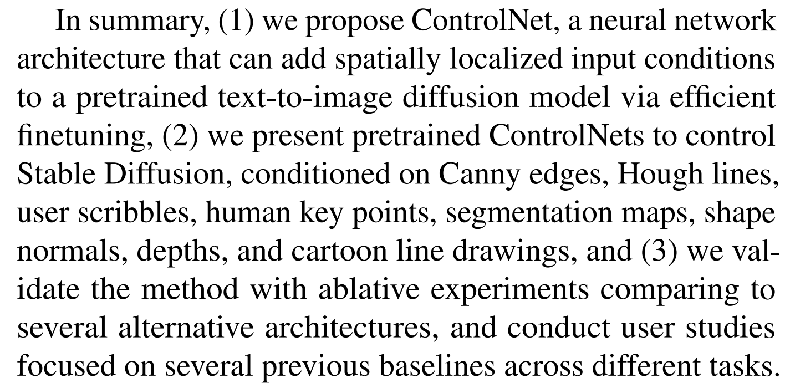
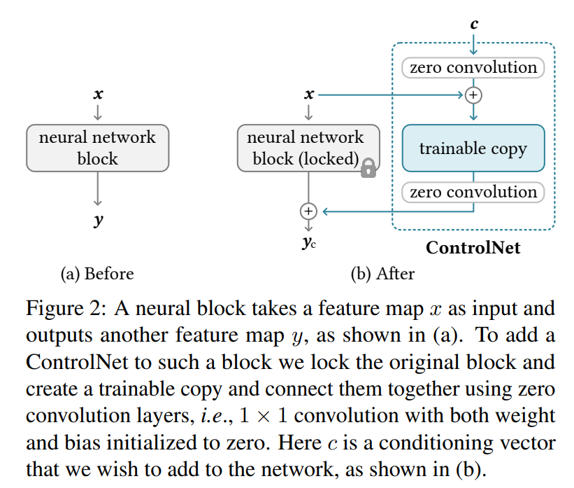
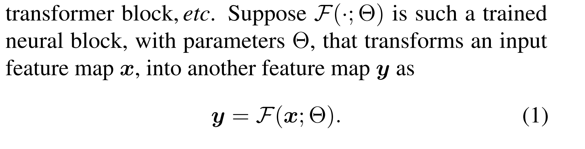
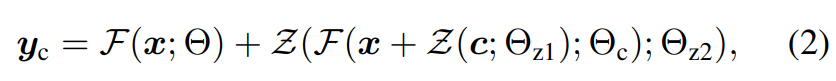
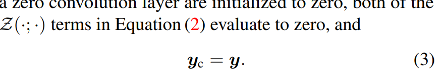
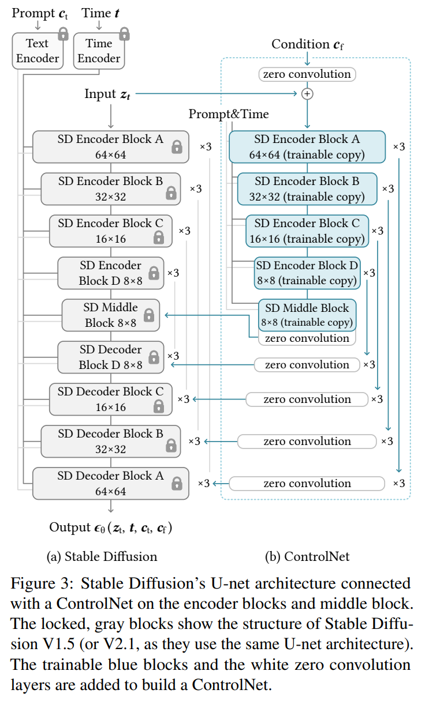
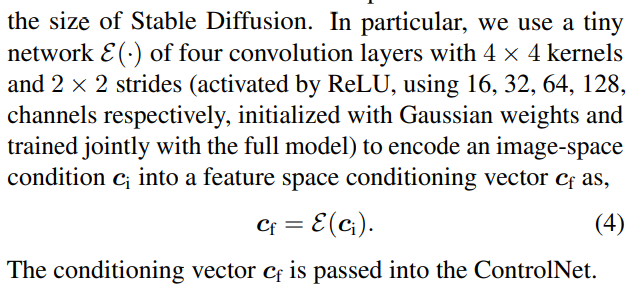
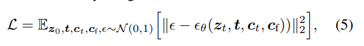
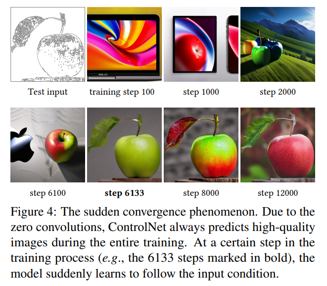

# 내용 정리: Adding Conditional Control to Text-to-Image Diffusion Models (ControlNet)

# Abstract

ControlNet이라는 이름의 아키텍쳐를 소개한다.

기존의 text-to-image Diffusion model에 여러가지 Control을 도입하는 것이다.

Control의 종류는 무궁무진하다. 

예를 들어 윗 행에서 처럼 Edge , 즉, 모서리 스케치만 주고 text에 따라 디테일을 바꾸거나

아랫 행에서 처럼 pose에 대한 skeleton만 주고 포즈만 유지한채 text에따라 디테일을 바꾸는 식이다.

대략적인 방법은 기존에 학습된 text-to-image Diffusion Model의 encoder까지는 freeze한 채로 재사용을 한다. 그다음 decoder단에 zero convolution layer를 붙인다.

이 parameter들이 zero initialized된 convolution layer는 점차적으로 원하는 control 조건에 맞는 결과물을 내도록 parameter가 바뀌는 것이다.

# 1. Introduction

내가 Control 하고싶은 조건에 해당하는 이미지를 Input으로 넣어준다.

이때, text는 추가로 줄 수 도있고 주지 않을 수도 있다.

이를 zero initialized convolution layer가 training과정중에 학습한다.

학습이 끝나면 유저는 text에 따라서 이제 내가 원하는 Control image에 맞게 generation을 할 수 있게 되는 것이다.

# 3. Method

3.1 ControlNet

Figure2 (a)가 원래의 diffusion모델이라고 치자.

ControlNet은 (a)는 그대로 놔두고 freeze한다. 그다음 이것의 복사본 trainable copy를 만든 뒤 앞 뒤에 zero initialized된 convolution layer를 추가한다.

그것이 (b)이다.

결과적으로 ControlNet은 (a), (b)로 두개의 block을 한꺼번에 묶어서 사용한다.

(b)는 우리가 원하는 Control을 학습하기 위한 block이다. 

Control c가 첫 번째 zero layer에 들어간다.

이 결과가 input x와 합쳐져 trainable copy에 들어간다.

이때, 동시에 freeze==locked된 nn block도 input x를 입력으로 받는다.

그다음은 trainable copy의 결과가 두 번째 zero layer에 들어간다.

최종 결과는 locked된 block에 들어간 output y와 두번째 zero layer의 결과물을 합친다.

그래서 위 식의 첫번째 항은 locked된 block의 결과물 

두번째 항은 zero layer의 결과물이다.

zero layer가 포함된 block에서는 Control c를 입력으로 받았기 때문에 이를 첫번째 항과 합치면

결과적으로 Control을 고려한 y(c)를 얻게 되는 것이다.

이때, 주목할 점은 학습을 시작할때, zero로 초기화 되어있기 때문에 

시작 단계에서는 위 사진과 같은 결과가 나온다는 점이다.

이것은 두 가지 큰 장점을 가진다.

첫째, 학습 초기에 잘못된 noise를 주지 않고 이미 잘 그리고 큰 데이터에 대해 pre-trained된 weight을 해치지 않는다. 

왜냐하면 gradient값이 0일 것이기 때문이다.

두번째, zero layer가 추가된 block은 pre-trained된 block의 복사본이고 input x또한 받기 때문에, 

input x에 대한 pre-trained에 대한 해석을 그대로 사용할 수 있다. 그렇기에 별다른 노력 없이도 아주 강한 backbone을 Control c에 사용할 수 있게 되는 것이다.

3.2 ControlNet for Text-to-Image Diffusion

먼저, 좌측 (a)사진을 통해 Stable Diffusion Model의 구조가 어떻게 되어있는지 복습해보자.

Stable Diffusion은 기본적으로 U-Net구조를 가진다.

이 U-Net구조는

12개의 encoder block, 1개의 moddle block, 다시 12개의 decoder block

총 25개의 block로 이루어져 있다.

이 중 8개는 UP or DOWN sampling을 위한 block이다.

나머지 17개는 각각 그 안에 4개의 resnet layer와 2개의 ViT(Vision Transformer) layer를 가지고 있다.

왼쪽 그림의 block 옆에 x3은 이런 블럭이 똑같이 3개 있다는 말이다 따라서 x3이 8번 되어있고 중간에 middle block이 한 개 있으니 25개 인것이다.

이제 ControlNet의 구조는 어떻게 되어있는지 확인해보자.

일단 trainable copy로 만드는 건 12개의 encoder block과 middle block이다.

(이 구조는 매우 전형적인 U-Net구조기 때문에 다른 Diffusion Model에도 쉽게 적용이 가능하다고 한다.)

512 x 512 image가 input이라고 하자. Stable Diffusion은 원래 첫 layer의 크기가 64 x 64기 때문에 512 x 512 → 64 x 64로 pre-processing을 한다.

마찬가지로 ControlNet도 pre-processing을 하는데, 그 구조는 다음과 같다.

pre-processing을 위한 네트워크를 가진다.

이 네트워크는 4 x 4 kernels, 2 x 2 strides를 가진 4개의 convolution  layers로 구성된다.

각 layer는 마지막에 ReLU로 활성화가 진행되며 16, 32, 64, 128개의 채널을 가지고 있다. 

Gaussian weights로 초기화 되어있으며 full model과 jointly하게 train되어 있다.

이 네트워크를 거친 결과를 Figure 3의 Condition c(f)로 사용하는 것이다.

3.3 Training

기존 Stable Diffusion모델의 Loss function에 우리가 Control로 준 조건인 c(f)만 추가된 모습이다.

또한 전체 Training과정 중 50%는 c(t)를 empty string으로 대체해서 진행한다.

이렇게 하면 c(t)에 집중하지 않고, c(f)에만 집중 할 수 있는 부분이 늘어나므로 c(f)에 대한 semantics을 좀 더 잘 이해하기 때문이다.

관측 결과 ControlNet은 c(f)를 이해하는 구간이 갑자기 나타나는 것이 보였다.

위 사진에서 6133을 기점으로 이전에는 관련없는 이미지를 뽑아내다가 갑자기 6133 부터 c(f)에 충실한 이미지를 생성해내는 것이다.

이것을 저자는 “sudden convergence phenomenon” 급작스런 수렴( gradient에서 수렴했다는 뜻은, 목적을 달성했다는 뜻이니까 이렇게 표현한 듯 하다.)이라고 표현한다.

이유는 몰?루 ( 논문에 명시되지 않음.)
