# 내용 정리: GoodDrag: Towards Good Practices for Drag Editing with Diffusion Models

# Abstract

이미지의 안정성과 퀄리티를 높이기 위한 framework를 소개하고자 한다.

framework의 이름은 AIDD

# 1. Introduction

이 논문은 두 가지를 새로운 점으로서 제시함.

 - 첫 번째, AIDD ( Alternating Drag and Denoising)

DragDiffusion에서 drag가 행해지는 방식:

전체 횟수의 Drag를 실행함. handle to target으로 그대로 가면 좋겠지만 당연히 어느정도 오차는 생길 수 밖에 없고 전체 횟수동안 누적됨 → 누적된 오차를 Denoising 단계에서 한꺼번에 바로잡음.

그러나, 누적된 오차를 살펴보면, Denoising단계에서 바로잡기에는 너무 커져 있는 경향이 있음.

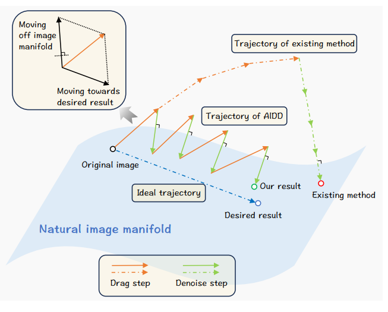

위 사진에서 Trajectory of existing method가 이에 해당됨. Drag step동안 오차가 누적되고 Denoising단계에서 이를 바로잡아서 Desired result로 다가가려 함.

그럼에도 불구하고, 누적된 오차가 너무 커져 있는 탓에 바로잡기는 불가능했음.

따라서 Trajectory of AIDD방식을 도입함.

GoodDrag의 방식 (AIDD): 

Drag과정이 끝난 뒤에 Denoising을 진행하는 것이 아니라,

이를 순서만 바꿔서

Drag 한 번 Denoising 한 번 이런 식으로 오차를 중간 단계에서 보정함.

그 결과 위 사진의 Trajectory of AIDD 처럼 Desired result에 좀 더 가까운 모습이 보임.

-두 번째, motion supervison의 개선.

위의 AIDD는 Diffusion과정 상의 순서만 바꾼것.

이번에는 Drag의 방식자체에 개선점을 주려고 하는 것.

original feature의 information-preserving motion supervision을 도입.

# 3. Methods

3.2 Drag Editing

-Existing framework

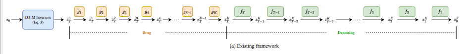

위 의 두 그림은 같은 것을 나타냄. 기존의 Drag Editing이 진행되는 방식임.

input image —> latent로 inversion

latent에 k-step만큼 Drag진행

그다음 latent —> output image 로 Denoising

 

Drag과정이 다 끝난 뒤, Denoising & 누적된 오차 바로잡기 진행

후술할 AIDD와의 주요한 차이점은 Single timestep T에 대해서’만’ Drag를 진행한다는 점임.

3.3 Alternating Drag and Denoising (AIDD)

-Alternating Drag and Denoising (AIDD)

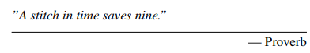

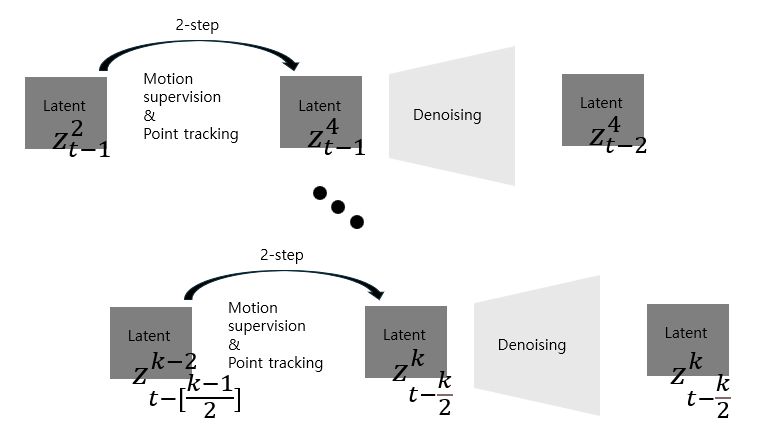

Existing method와는 다르게 k-step만큼 Drag를 다 한뒤에 Denoising을 하는 것이 아니라,

일정 step만큼 Drag 진행

Denoising 진행

다시 일정 step만큼 Drag진행

Denoising 진행

이것을 k-step까지 반복.

그 뒤는 image가 될때까지 Denoising 진행.

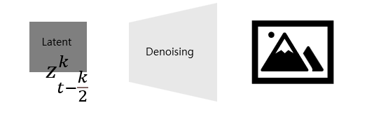

인 것이다.

이제 이 그림을 다시 보면 차이가 좀 더 명확하게 느껴질 것.

AIDD는 추가적인 계산법의 도입 없이, 그저 순서만 바꾼 것으로 결과물의 향상을 이끌어냄.

그러면 어째서 발생하는 오차를 누적 시킨 것보다, 여러 횟수에 걸쳐서 나누어 해결하는 것이 더 효과적인가?

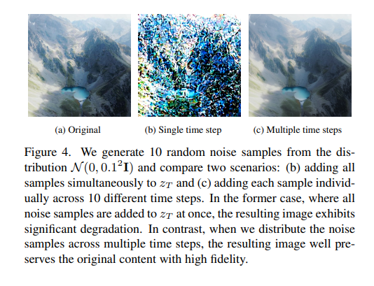

논문의 저자도 궁금해서 추가 실험을 해봄.

똑같이 10번의 noise 를 latent에 주입하는 실험임.

(b)는 t번째에만 , Single timestep에 noise 를 주입한 뒤 이를 이미지로 만들어봄.

원본(a)과 달리 상당히 많이 깨져 있는 모습.

(c)는 t번째에 1번 t-1번째에 1번 이런 식으로 Multiple time steps에 걸쳐서 noise 를 주입함.

그 결과 (b)에 비해서 훨씬 (a)에 가까운 모습을 보임.

주입한 noise의 강도는 같은데 단순히 순서를 바꾼 것 만으로 결과의 비약적인 상승이 일어났다는 것임. 

개인적인 해석:  

예를 들어, 미끄럼틀에서 공을 굴린다고 생각해보자. 끝에 다다랐을 때 내려오고 있는 공은 가속도가 붙어있는 상태일 것이기 때문에 멈추는 데 많은 힘이 들 것이다.

그러나 끝에 다다르지 않고 공을 굴리기 시작한 시점에서 얼마 안 가서 멈추려고 하면, 공에 붙어있는 가속도가 적은 상태이기 때문에 이를 멈추는 데 상대적으로 적은 힘이 들 것이다.

이것과 비슷한 원리이지 않을까 생각한다.

3.4. Information-Preserving Motion Supervision

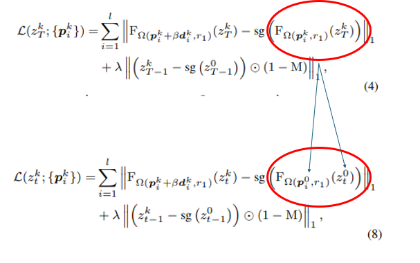

(4)는 기존 방식의 Motion Supervision Loss.

(8)은 Imformation-Preserving Motion Supervision Loss

next handle point의 오차를 현재 점과의 차이로 정의(4) 하는 것이 아니라

아예 처음 k-step을 거치지 않은, 유저의 input handle point로 정의(8)함.

당연히 이러면 원본과의 충실성은 높아짐.

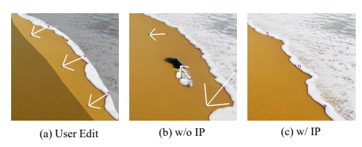

(b)는 (4)의 결과

(c)는 (8)의 결과

물론 이렇게 하면 새로운 문제점이 발생함.

오차가 자연히 커질 수 밖에 없기 때문에 최적화가 어려워짐.

이를 해결하기 위해 (8)에 직관적인 변형을 가함.

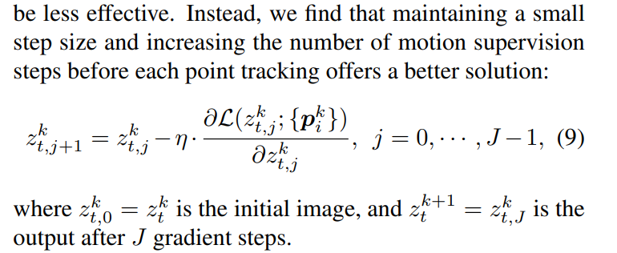

그냥 

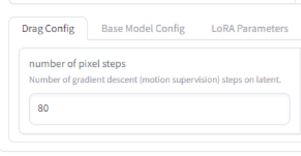

motion supervision이 실행되는 step을 늘렸다고 한다.

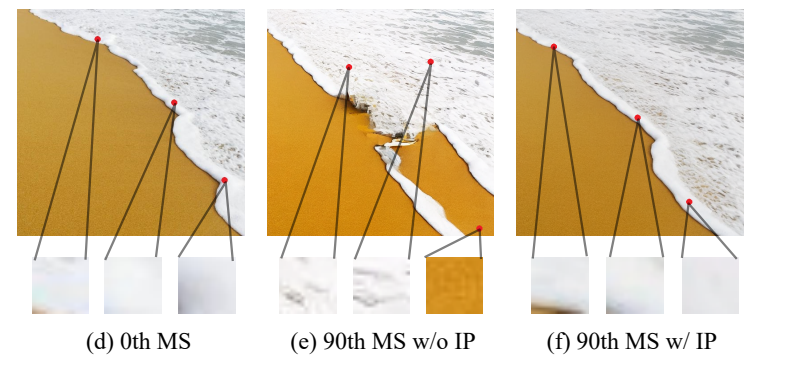

그 결과가 (f)에 나타난 것.

최종 Algorithm, Pipeline

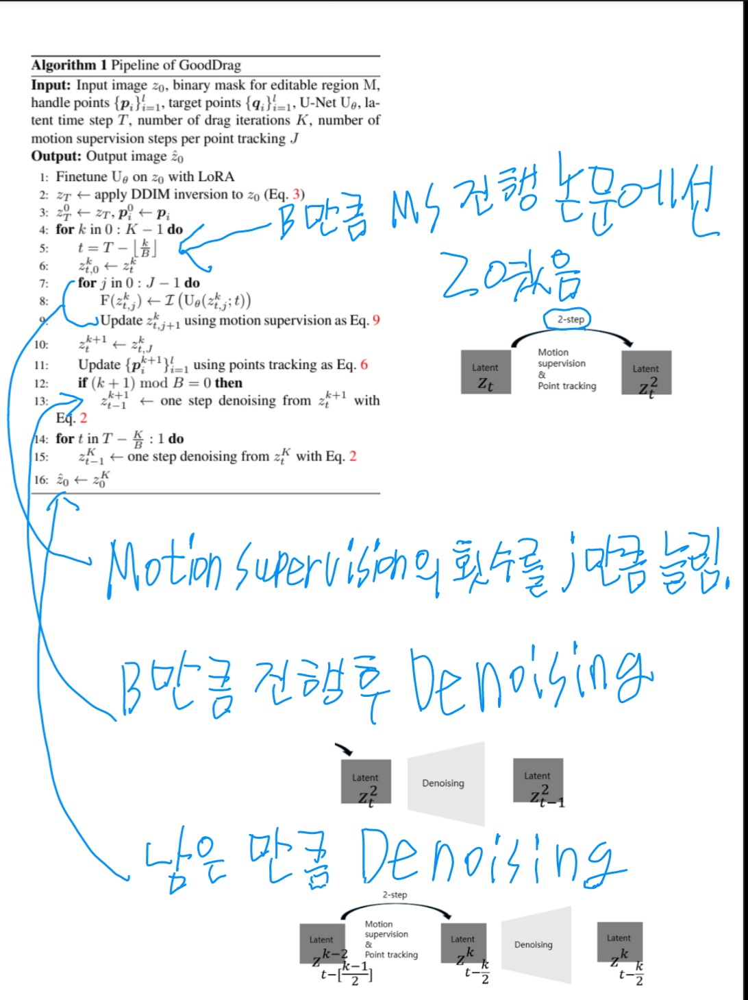
